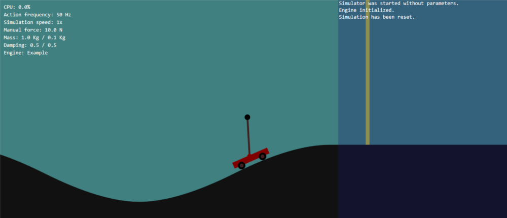

# Cart-Pole Simulator

A Cart-Pole control simulator for Windows. Low-level Win32 API implementation using DirectX. No third-party libraries or dependencies.

**Features:**
- Manual control of the cart through the keyboard.
- Changing the camera view/zoom with mouse.
- Adding a control mechanism (engine) through dynamically linked library DLL.
- Changing the simulation parameters: forces, mass, gravity, ...
- Instantly resetting the simulation (suitable for reinforcement learning).
- Shaping the terrain by adding craters and hills.
- Adding vertical markers of any color.
- Speeding up the simulation.
- Recording the animation (individual frames are saved as .png files).
- Logging.

## Building the simulator

Open the cartpole.sln solution in Visual Studio and build the projects. The executable `cartpole.exe` and the example engine `cartpole.dll` will appear in the `./bin` folder.

## Running the simulator

Without the engine (`cartpole.dll`), the simulator offers only keyboard control on a flat terrain. If a properly compiled `cartpole.dll` is present in the same folder as `cartpole.exe`, the engine is loaded and initialized. The user may specify a different DLL location and name using the '-engine' switch:

`cartpole.exe -engine </path/to/filename>.dll`

If additional arguments are given after the name of the DLL file, they are passed to the engine. It is then up to the engine to interpret them.

The engine is free to change the size of the window, the shape of the terrain and all simulation parameters. It can implement new keyboard functions or suppress the default ones. It can speed up the simulation or run it in the console mode. It communicates with the user through log messages, which are visible on the screen and saved to a file when the simulator is shutdown.

## Building an engine

The engine must expose the following functions:
- `simulatorInitialize` - called when the simulator is started to set the simulation parameters.
- `simulatorShutdown` - called when the simulator is being shutdown, so the engine may also properly shutdown.
- `setInitialState` - called when the simulation is being reset. The engine decides on the initial state.
- `stateUpdated` - called when the state of the simulation is being updated. The engine may at this point also change some simulator parameters (e.g., move the camera).
- `applyAction` - called when the simulator is about to execute an action. The engine may decide on a specific action or allow a manual keyboard action to be executed.
- `keyPressed` - called whenever a key is being pressed or released. The engine may ignore it, act on it or suppress its default behavior.

For a minimal engine example see the `engine` project included in the `cartpole.sln` solution.

## Acnowledgements

If you find this code useful in your project/publication, please add an acknowledgements to this page.